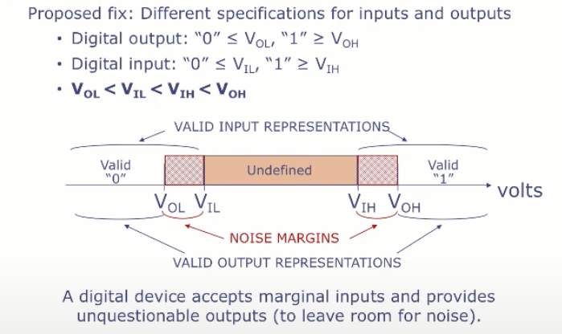

# 1. The Digital Abstraction
##### 16/02/2022 By Angold Wang

## 1. Abstractions
```
Computer Programs

======================> Virtual Machines

Module 3: Computer Systems
Operating systems, virtual memory, I/O

======================> Instruction set + memory

Module 2: Computer Architecture
Assembly language, processors, caches, pipelining

======================> Digital circuits

Module 1: Digital Design
combinational and sequencial circuits

======================> Bits, logic gates

Atoms, Materials

```
#### These Abstractions:

* **Are actually interfaces that let us reason about the behavior of our building blocks, without understanding the implementation details underneath.**
* **Are extremely long-lived, which live far longer than the specific implementations of these building blocks.**
* **Shielding the levels above from from the details of the implementation.**
* **Can limit complexity at each level, which shorten design time.**

## 2. Analog vs. Digital Systems
* **Analog systems** represent and process information using **continuous signals**.
* **Digital systems** represent and process information using **discrete symbols**.

The reason why **digital system** are practically used **everywhere** and **analog system** are used only in very **limited circumstances**:
#### Digital Systems Tolerate Noise !!!

Which makes Digital systems can process information reliably at very high speeds.

## 3. Using Voltages "Digitally"




#### Voltage Transfer Characteristic (VTC)


1. **VTC must avoid the shaded regions (aka "forbidden zones") which correspond to valid inputs but invalid outputs**
2. **The VTC can do anything when Vil < Vin < Vih.**
3. **There's some amplification going on (ACTIVE, an amplifier or a transistor) which is injecting energy into the circuit when Vin > Vil.**


