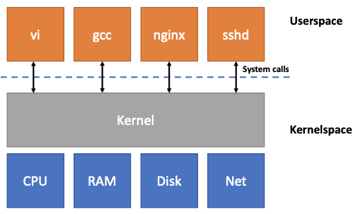
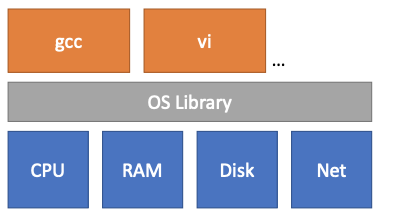
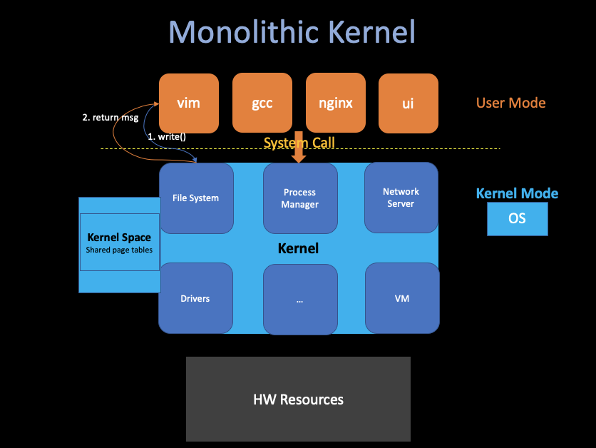
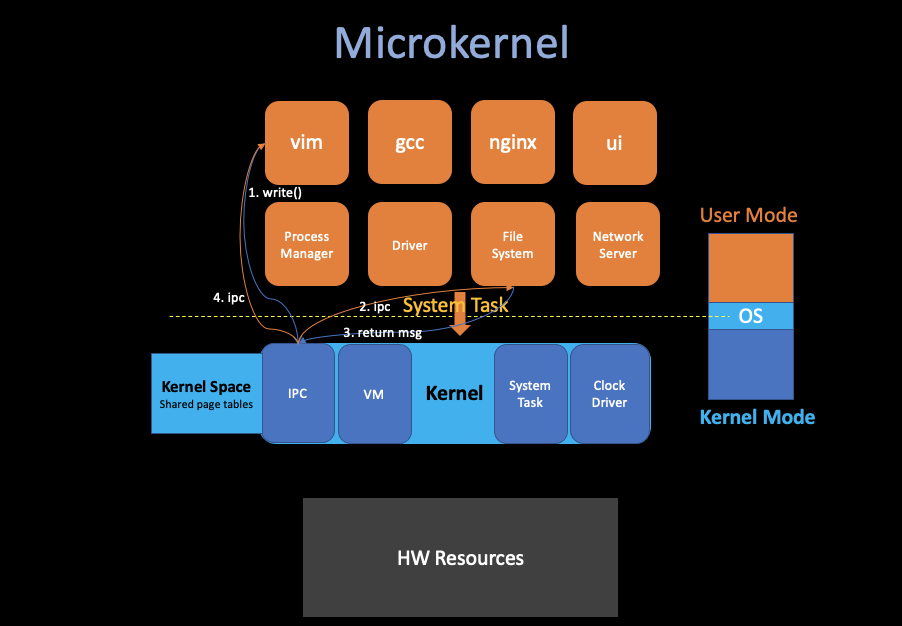

# 1. Introduction

##### 02/16/2022 By Angold Wang

## 1. Overview

### i. OS Purposes
* **Abstract H/W**
    * Computer(CPU, Memory, Disk...) Low level set of resources.
    * OS provide high-level interfaces and abstractions that app can use.
* **Multiplexing / Isolation**
    * Run many applications at same time, without having them interfere.
* **Sharing**
* **Security**
* **Performance**
    * Whatever services it provides, don't get in the way of applicatins getting high performance.
    * Maybe even help applications achieve good performance.
* **Range of Uses**

### ii. Why do we need an Operating System ? 

#### Strawman Design: No OS:
* **Application directly interactes with hardware**
    * CPU cores & registers
    * DRAM chips
    * Disk blocks
    * ...
* **OS acts as a library (perhaps abstracts some of hardware)**

#### Problems:
* **Not conductive to multiplexing** (No enforced multiplexing)
    * Each processes periodically must **give up** the hardware.
    * One process forgets to give up or in an infinite loop, no other processes run.

* **Not memory isolation** (All apps share physical memory)
    * One app can overwrite another app's memory.
    * One app can overwrite the OS library.
* ......

### iii. Revisit Purposes: Bring Abstraction
#### The OS Interface abstracts the hardware resources, and make it easier/possible to provide the strong isolation, etc. 

#### Processes
* The Abstraction of CPU

Instead of having direct CPUs to manipulate or given to the application, OS provides processes, which **abstract the CPU itself** so that the operating system can multiplex in one or multiple CPU(s) among multiple applications.

**We add this layer between CPU and applications so that behind the scenes the kernel can switch between processes in order to switch different applications.**

> Example: The RISC-V CPU we are using in the lab that actually four cores. Which means you can run four processes in parallel. What the OS does is that in case you have eight applications. It will take several cores **Time Multiplexes** between different processes. **(Enforces that no process can run longer than 100 milliseconds)**

#### Exec
* The Abstraction of Memory
* **Each process can have its "own" memory**

When you call the **`exec`** system call with specifc filename (`PE` for Windows, `ELF` for Unix). And what in that file is basically is the memory image of a program, such as segmentation data etc., and that forms the memory of the application.

**The application will never have a direct access to physical memory (i.e. By specifying the phsical address), they can only grow its memory by system call, for example `sbrk` can help applications grow their memory.**

#### Files
* The Abstraction of Disk Block
* **In Unix, the only way to interact with the storage system is through files.**

OS provides convenient names of each file, and allows files to be shared by different apps and users.

## 2. Kernel and System Call
### i. OS Should Be Defensive
* **An App crash will not crash the OS.**
* **An App shouldn't be able to break out of isolation domain and then take control of the kernel.**

### ii. Achieve this Strong Isolation: Hardware Support
**Strong isolation requires a hard boundary between applications and the operating system. So it is not enough to just implement all these stuff in the OS level.** All series processors that are intended to run an operating system in multiple applications have to support these **Hardware Support**.

#### User / Kernel Mode

* **User Mode**
    * CPU Mode Flag = `1`
    * CPU can only execute **Unprivileged** instructions.

* **Kernel Mode**
    * CPU Mode Flag = `2`
    * CPU can only execute **Privileged** instructions.
    * The software running in kernel mode (space) is called the **kernel**

* **The Unprivileged instructions, like `add`, `sub`, `call`, `jmp` or `branch` .etc.**
* **The Privileged instructions, like "set up the page table register", "disable clock" or "disable interrupt". etc. They are all kinds of states on the processor that the operating system is tend to use, manipulating that state is donne for privilieged instructions.**

**For example, If CPU find a user application tries to actually execute a privileged instruction, then the processor won't execute it**, and that will result in the transfer control from user mode to kernel mode so that the operating system can actually take control, and maybe kill the application because it is misbehaving.

#### Virtual Memory

* **Strong memory isolation.**
* **Page Table: map virtual address into physical address.**
* **Each process has its own page table.** Which means each process can actually only allowed to access that piece of physical memory that actually shows up in the page table.
* **Kernel also has its own page table, called Kernel Space.**

### iii. Kernel - the trusted computing base
* **Kernel must be "correct"**
    * if there is a bug in the kernel, maybe an attacker is able to tickle that bug and turn the bug into an exploit.
    * That exploit maybe allow that particular attacker to break out of isolation or take some control over the kernel.
* **Kernel must treat processes as malicious**

## 3. Kernel Organization

A Key design question is that what part of the operating system should run in supervisor mode.

### i. Monolithic Kernel
**One possible answer is that the entire operating system resides in the kernel, which means the entire operating system runs with full hardware priviledge.**

* **Pros:**
    * Tight integration: it is easier for different parts of the operating system to cooperate.
    * **Which will lead a great performance**
* **Cons:**
    * There are a lot of code in the kernel, which will bring many bugs.

### ii. Microkernel
**Another design which basically focuses on reducing the amount of code in the kernel,** which let many OS services run as ordinary user programs, and the kernel only implements minimal mechanism to services in user space.

* **Pros:**
    * More isolation, can pick which we part want in different using environment.
    * Less code, hopefully less bugs and easier to implement.

* **Cons:**
    * Maybe hard to get good performance (Too much **ipc**)

