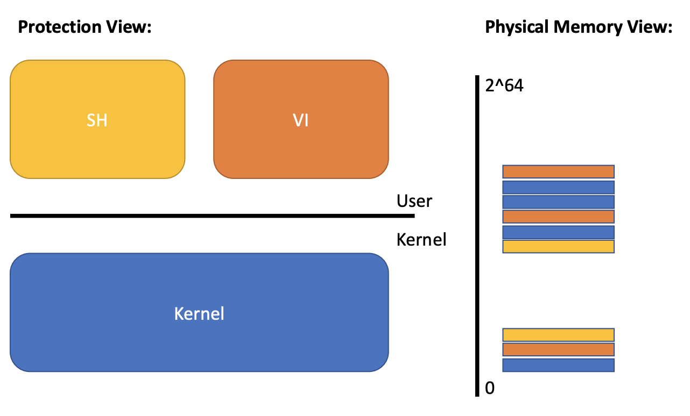
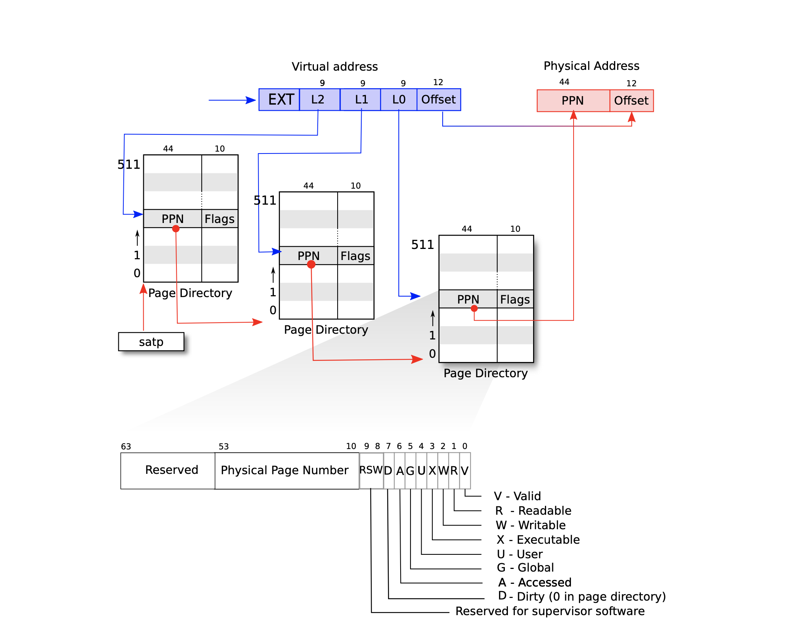

# 2. Virtual Memory
##### 03/03/2022 By Angold Wang

### Kernel with "Isolation"
* **Restrict each user processes so that all it can do is read/write/execute its own user memory, and use the 32 gerneral-purpose RISC-V registers.**
* **One user-process can only affect the kernel and other processes in the ways that system calls are intended to allow**


## 1. Memory Isolation


The RISC-V instructions (both user and kernel) **manipulate** **virtual addresses**. But machine's RAM, or physical memory, is indexed with **physical addresses**. 

In the **[last](https://a4org.github.io/os/docs/lectures/1Introduction.html)** note, we mentioned that one way to bring isolation is through **Virtual Memory**.
The main purpose of **Virtual Memory** is to achieve **strong Memory Isolation**.

* Each process has its own memory
* It can read and write its own memory
* It cannot read or write anything else directly (must through syscall, with privileges)
* **Each process believes that they have full memory space under control** (Two processes with "same" virtual address)



How to multiplex several memories over one physical memory? while maintaining isolation between memories.

## 2. Paging Hardware

### i. Level of Indirection Indexing


* Software can only read and write to virtual memory.
* Only kernel can program mmu (Memory Manage Unit), **which means this VA -> PA mapping is completely under the control of the Operating System.**
* MMU has a **Page table** that maps virtual addresses to physical adresses.
* Some virtual addresses restricted to kernel-only.

### ii. Virtual Address to Page

#### Why we need page?
Imagine that a `64-bit` machine, which means it support `2^64` memory address, if we just simply map one **VA** into one **PA**, the mapping table continuous store in memory will be also `2^64` -- which is gigantic.

**So we use another way, instead store this mapping relationship in a very gigantic continuous mapping array, we divide them into different pages, and each virtual address contains two message: `page_id` and `offset`.**

**Each process has its own `page_table`, which managed by the kernel**, here is the **`proc`** structure in xv6:

```c
struct proc {
  struct spinlock lock;

  // p->lock must be held when using these:
  enum procstate state;        // Process state
  void *chan;                  // If non-zero, sleeping on chan
  int killed;                  // If non-zero, have been killed
  int xstate;                  // Exit status to be returned to parent's wait
  int pid;                     // Process ID

  // wait_lock must be held when using this:
  struct proc *parent;         // Parent process

  // these are private to the process, so p->lock need not be held.
  uint64 kstack;               // Virtual address of kernel stack
  uint64 sz;                   // Size of process memory (bytes)
  pagetable_t pagetable;       // User page table (Which table / start address)
  struct trapframe *trapframe; // data page for trampoline.S
  struct context context;      // swtch() here to run process
  struct file *ofile[NOFILE];  // Open files
  struct inode *cwd;           // Current directory
  char name[16];               // Process name (debugging)
};

```

#### High-level view of xv6 page table

xv6 runs on Sv39 RISC-V, which means that only the bottom `39` bits of a 64-bit virtual address. **A RISC-V page table is logically an array of `2^27` (`134,217,728`) page table entries (PTE). Each PTE contains a `44-bit` physical page number (PPN) and `10-bit` flags.**


### iii. Page to Page Directory

**Revisted: Would it be reasonable for page table to just be an array of PTEs?**
* **`2^27` is roughly `134` millions**
* **`64` bits per page entry**
* **`134 * 8bytes * million` for a full page table**
    * wasting roughly `1GB` per page table
    * one page table per address space
    * one address space per application
* **Would waste losts of memory for small programs!**
    * you only need mappings for a few hundred pages.
    * so the rest of the million entries would be there but not needed


#### Satp Register
**Each CPU core has its own unique `%satp` register, where store the current-running process's page table starting address of its CPU.**

#### 3-level page table (Page Directory)

As we see that above, it is not good to just simply have a giant page table per process. In real translation at MMU, **A page table is stored in physical memory as a three-level tree. Each level is a page directory, which is `4096 bytes`, and contains `512 (2^9)` 64-bit page table entries. And that 3-level `2^9` PTEs can be located via the first 27 bits virtual address.**




This three-level structure of above figure **allows a memory-efficient way of recording PTEs, which means in the 3-level page table, you can leave a lot of entries empty.**

For example, if you leave the entry in the top level page table directory empty, for those entries, you don't have to create middle level page tables or bottom level page tables at all. **And then we can allowcate these chunks on demand.**


