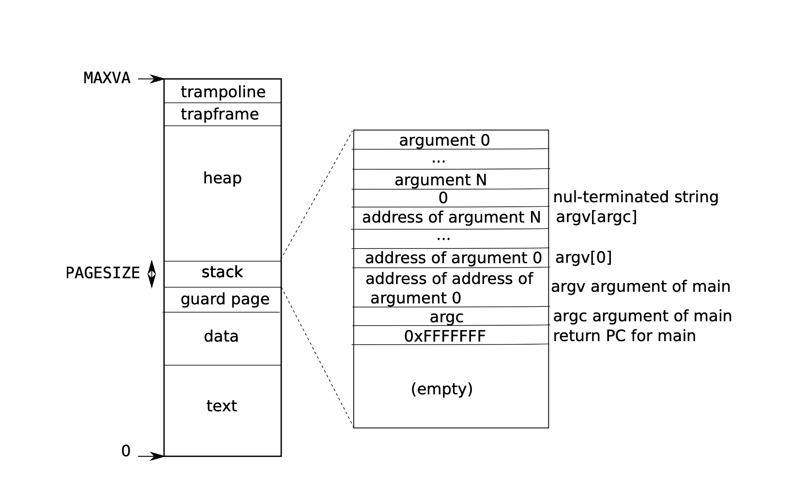
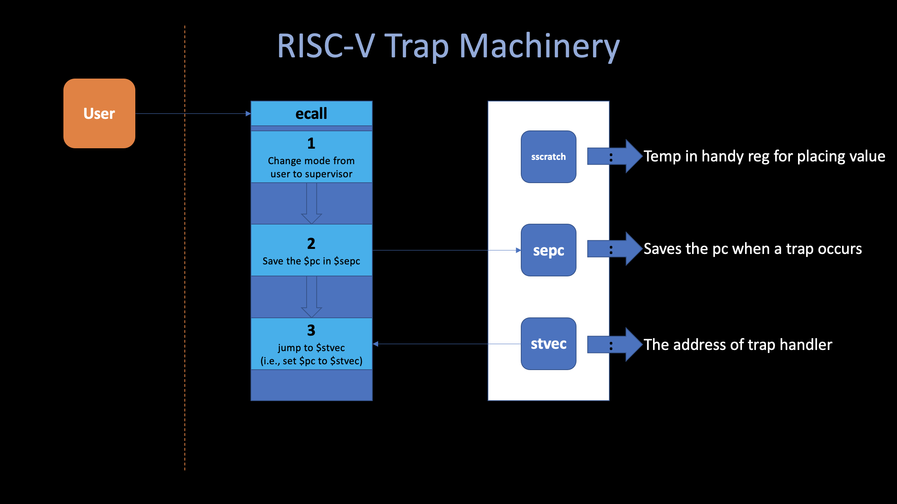
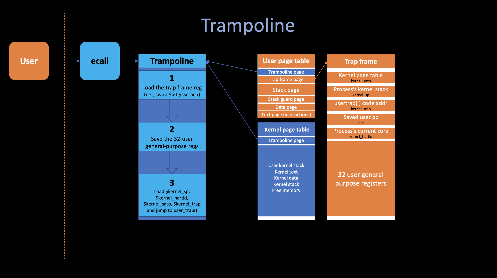

# 3. Special Topic: Traps

##### 03/06/2022 By Angold Wang

There are three kinds of event which cause the CPU to set aside ordinary execution of instructions and force a transfer of control to special code that handles the event:
1. **System Call:** When a user program executes the **`ecall`** instruction to ask the kernel to do something for it.
2. **Exception:** When an instruction (user/kernel) does something illegal, such as divide by zero or use an invalid virtual address.
* **Interrupt:** When a device signals that it needs attention.

**Trap is a generic term for these situations.**
Typically, whatever code was executing at the time of the trap will later need to resume, and shouldn't need to be aware that anything special happends.

**In this topic, we'll step into the actual `xv6` code and check the details of how traps were implemented by walking through a whole `SYS_write` system call procedule when we booting the `xv6`.**


## 0. Boot xv6

When the RISC-V computer powers on. It initializes itself and runs a boot loader which is stored in read-only memory. The boot loader loads the xv6 kernel into memory.

The loader loads the xv6 kernel into memory at physical address **`0x80000000`**. The reason it places the kernel at **`0x80000000`** rather than **`0x0`** is because the address range **`0x0:0x80000000`** contains I/O devices.


### i. `_entry`

Then in **machine mode**. The CPU executes xv6 starting at `_entry` **(kernel/entry.s)**

```asm
    # qemu -kernel loads the kernel at 0x80000000
    # and causes each CPU to jump there.
    # kernel.ld causes the following code to
    # be placed at 0x80000000.
.section .text
.global _entry
_entry:
	# set up a stack for C.
        # stack0 is declared in start.c,
        # with a 4096-byte stack per CPU.
        # sp = stack0 + (hartid * 4096)
        la sp, stack0
        li a0, 1024*4
        csrr a1, mhartid
        addi a1, a1, 1
        mul a0, a0, a1
        add sp, sp, a0
	# jump to start() in start.c
        call start
spin:
        j spin

```

**Basically, this piece of code does two things:**

1. **Set up a stack so that xv6 can run C code. and set the stack pointer `%sp` with the address `stack0 + 4096`.**
    * Set the stack in order to let xv6 run C code
    * The `stack0` is defined in `kernel/start.c`, which is the initial stack of xv6.
2. **Then calls into C code at `start` at `kernel/start.c`**


### ii. `start`

```c
// entry.S jumps here in machine mode on stack0.
void
start()
{
  // set M Previous Privilege mode to Supervisor, for mret.
  unsigned long x = r_mstatus();
  x &= ~MSTATUS_MPP_MASK;
  x |= MSTATUS_MPP_S;
  w_mstatus(x);

  // set M Exception Program Counter to main, for mret.
  // requires gcc -mcmodel=medany
  w_mepc((uint64)main);

  // disable paging for now.
  w_satp(0);

  // delegate all interrupts and exceptions to supervisor mode.
  w_medeleg(0xffff);
  w_mideleg(0xffff);
  w_sie(r_sie() | SIE_SEIE | SIE_STIE | SIE_SSIE);

  // configure Physical Memory Protection to give supervisor mode
  // access to all of physical memory.
  w_pmpaddr0(0x3fffffffffffffull);
  w_pmpcfg0(0xf);

  // ask for clock interrupts.
  timerinit();

  // keep each CPU's hartid in its tp register, for cpuid().
  int id = r_mhartid();
  w_tp(id);

  // switch to supervisor mode and jump to main().
  asm volatile("mret");
}
```

**Machine Mode vs. Supervisor Mode**: Machine mode has access to all the hardware features but does not have virtual-memory support.

1. **Writing `main`'s address into register `%mepc` in order to return to `main` after `start` finished**
2. **Writing `0` into the page-table register `satp` in order to disables virtual address translation** (we haven't set the page table yet).
3. Program the clock chip to generate clock interrupt (0.1s).

Although we haven't set any page table yet (even for kernel page table), we still can access some physical memory. The reason is that "**Identical Mapping**" in xv6, which  **mapping the resources at virtual address between `0x80000000` to `0x86400000` that are equal to the physical address.**

### iii. `main`

```c
// start() jumps here in supervisor mode on all CPUs.
void
main()
{
  if(cpuid() == 0){
    consoleinit();
    printfinit();
    printf("\n");
    printf("xv6 kernel is booting\n");
    printf("\n");
    kinit();         // physical page allocator
    kvminit();       // create kernel page table
    kvminithart();   // turn on paging
    procinit();      // process table
    trapinit();      // trap vectors
    trapinithart();  // install kernel trap vector
    plicinit();      // set up interrupt controller
    plicinithart();  // ask PLIC for device interrupts
    binit();         // buffer cache
    iinit();         // inode table
    fileinit();      // file table
    virtio_disk_init(); // emulated hard disk
    userinit();      // first user process
    __sync_synchronize();
    started = 1;
  } else {
    while(started == 0)
      ;
    __sync_synchronize();
    printf("hart %d starting\n", cpuid());
    kvminithart();    // turn on paging
    trapinithart();   // install kernel trap vector
    plicinithart();   // ask PLIC for device interrupts
  }

  scheduler();        
}
```

**This is the `main()` boot sequence of xv6, We are going to only introduce two procedures since we only mentioned these two concepts before.**
* **`kvminit()` for initializing kernel page table**
* **`userinit()` for making the first user system call**

### iv. `main` -- `kvminit()`

```c
// Initialize the one kernel_pagetable
void
kvminit(void)
{
  kernel_pagetable = kvmmake();
}
```
**`main` calls `kvminit` to create the kernel's page table using `kvmmake`, this call occurs before xv6 has enabled paging on the RISC-V, so the address refer directly to physical memory.**

```c
// Make a direct-map page table for the kernel.
pagetable_t
kvmmake(void)
{
  pagetable_t kpgtbl;

  kpgtbl = (pagetable_t) kalloc();
  memset(kpgtbl, 0, PGSIZE);

  // uart registers
  kvmmap(kpgtbl, UART0, UART0, PGSIZE, PTE_R | PTE_W);

  // virtio mmio disk interface
  kvmmap(kpgtbl, VIRTIO0, VIRTIO0, PGSIZE, PTE_R | PTE_W);

  // PLIC
  kvmmap(kpgtbl, PLIC, PLIC, 0x400000, PTE_R | PTE_W);

  // map kernel text executable and read-only.
  kvmmap(kpgtbl, KERNBASE, KERNBASE, (uint64)etext-KERNBASE, PTE_R | PTE_X);

  // map kernel data and the physical RAM we'll make use of.
  kvmmap(kpgtbl, (uint64)etext, (uint64)etext, PHYSTOP-(uint64)etext, PTE_R | PTE_W);

  // map the trampoline for trap entry/exit to
  // the highest virtual address in the kernel.
  kvmmap(kpgtbl, TRAMPOLINE, (uint64)trampoline, PGSIZE, PTE_R | PTE_X);

  // map kernel stacks
  proc_mapstacks(kpgtbl);
  
  return kpgtbl;
}

```

1. **`kvmmake` first allocates a page of physical memory to hold the root page-table page.**
2. **Then it calls `kvmmap` to install the translations(page tables) that the kernel needs:**
    * kernel's instructions and data. 
    * physical memory up to `PHYSTOP`
    * memory ranges which are actually devices
3. **Finially it calls `proc_mapstacks` in order to allocate a kernel stack for each process.**


* After all these mappings are done, the kernel's page table should looks like this:

```
(qemu) info mem
vaddr            paddr            size             attr
---------------- ---------------- ---------------- -------
000000000c000000 000000000c000000 0000000000400000 rw-----
0000000010000000 0000000010000000 0000000000002000 rw-----
0000000080000000 0000000080000000 0000000000001000 r-x--a-
0000000080001000 0000000080001000 0000000000007000 r-x----
0000000080008000 0000000080008000 0000000000017000 rw-----
000000008001f000 000000008001f000 0000000000001000 rw---a-
0000000080020000 0000000080020000 0000000007fe0000 rw-----
0000003ffff7f000 0000000087f78000 0000000000040000 rw-----
0000003ffffff000 0000000080007000 0000000000001000 r-x----

```

```c
// add a mapping to the kernel page table.
// only used when booting.
// does not flush TLB or enable paging.
void
kvmmap(pagetable_t kpgtbl, uint64 va, uint64 pa, uint64 sz, int perm)
{
  if(mappages(kpgtbl, va, sz, pa, perm) != 0)
    panic("kvmmap");
}

// Create PTEs for virtual addresses starting at va that refer to
// physical addresses starting at pa. va and size might not
// be page-aligned. Returns 0 on success, -1 if walk() couldn't
// allocate a needed page-table page.
int
mappages(pagetable_t pagetable, uint64 va, uint64 size, uint64 pa, int perm)
{
  uint64 a, last;
  pte_t *pte;

  if(size == 0)
    panic("mappages: size");
  
  a = PGROUNDDOWN(va);
  last = PGROUNDDOWN(va + size - 1);
  for(;;){
    if((pte = walk(pagetable, a, 1)) == 0)
      return -1;
    if(*pte & PTE_V)
      panic("mappages: remap");
    *pte = PA2PTE(pa) | perm | PTE_V;
    if(a == last)
      break;
    a += PGSIZE;
    pa += PGSIZE;
  }
  return 0;
}
```

**`kvmmap` calls `mappages`, which installs mappings into a page table for a range of virtual addresses to a corresponding range of physical addresses.** It does this seperately for each virtual address in the range, at page intervals. For each virtual address to be mapped, **`mappages`** calls **`walk`** to find the address of the PTE for that address. It then initializes the PTE to hold the relevant physical page number, and set its desired permissions.


**Basically, what the `mappages` does is that it creates many page tables by calling `walk`, in order to map `size` of memory from virtual address `va` to physical address `pa`.**

```c
// Return the address of the PTE in page table pagetable
// that corresponds to virtual address va.  If alloc!=0,
// create any required page-table pages.
//
// The risc-v Sv39 scheme has three levels of page-table
// pages. A page-table page contains 512 64-bit PTEs.
// A 64-bit virtual address is split into five fields:
//   39..63 -- must be zero.
//   30..38 -- 9 bits of level-2 index.
//   21..29 -- 9 bits of level-1 index.
//   12..20 -- 9 bits of level-0 index.
//    0..11 -- 12 bits of byte offset within the page.
pte_t *
walk(pagetable_t pagetable, uint64 va, int alloc)
{
  if(va >= MAXVA)
    panic("walk");

  for(int level = 2; level > 0; level--) {
    // 
    // PX extract the three 9-bit page table indices from a virtual address.
    pte_t *pte = &pagetable[PX(level, va)];
    if(*pte & PTE_V) { // valid or not
      pagetable = (pagetable_t)PTE2PA(*pte);
    } else {
      if(!alloc || (pagetable = (pde_t*)kalloc()) == 0)
        return 0;
      memset(pagetable, 0, PGSIZE);
      *pte = PA2PTE(pagetable) | PTE_V;
    }
  }
  return &pagetable[PX(0, va)]; // the new page table
}
```

**Finally comes to `walk`, this function mimics the RISC-V paging hardware as it looks up the PTE for a virtual address.** 
1. **`walk`** descends the 3-level page table 9 bits at the time. It uses each level's 9 bits of virtual address to find the PTE of either the next-level page table or the final page table.
2. If the PTE isn't valid, then the required page hasn't yet been allocated; if the `alloc` argument is set, **`walk`** allocates a new page-table page and puts its physical address in the PTE.
3. Finally, it returns the address of the PTE in the lowest layer in the tree. 


After all page tables of kernel has been created successfully, **`main`** calls **`kvminithart`**, which install this kernel page table by writing the physical address of the root page table page into the register `satp`, and then allow CPU translate addresses using the kernel page table.

```c
// Switch h/w page table register to the kernel's page table,
// and enable paging.
void
kvminithart()
{
  w_satp(MAKE_SATP(kernel_pagetable));
  sfence_vma();
}

```

### v. `main` -- `userinit()`

**After `main` initializes several devices, subsystems and memory, it create the first user process by calling `userinit`.**

```c
// a user program that calls exec("/init")
// od -t xC initcode
uchar initcode[] = {
  0x17, 0x05, 0x00, 0x00, 0x13, 0x05, 0x45, 0x02,
  0x97, 0x05, 0x00, 0x00, 0x93, 0x85, 0x35, 0x02,
  0x93, 0x08, 0x70, 0x00, 0x73, 0x00, 0x00, 0x00,
  0x93, 0x08, 0x20, 0x00, 0x73, 0x00, 0x00, 0x00,
  0xef, 0xf0, 0x9f, 0xff, 0x2f, 0x69, 0x6e, 0x69,
  0x74, 0x00, 0x00, 0x24, 0x00, 0x00, 0x00, 0x00,
  0x00, 0x00, 0x00, 0x00
};


// Set up first user process.
void
userinit(void)
{
  struct proc *p;

  // Look in the process table for an UNUSED proc.
  p = allocproc(); // total 64 process, 
  initproc = p;
  
  // allocate one user page and copy init's instructions
  // and data into it.
  uvminit(p->pagetable, initcode, sizeof(initcode));
  p->sz = PGSIZE;

  // prepare for the very first "return" from kernel to user.
  p->trapframe->epc = 0;      // user program counter
  p->trapframe->sp = PGSIZE;  // user stack pointer

  safestrcpy(p->name, "initcode", sizeof(p->name));
  p->cwd = namei("/");

  p->state = RUNNABLE;

  release(&p->lock);
}
```

**`userinit` basically does these things:**
1. It look in the process table for an unused proc by calling **`allocproc`**
2. Call **`uvminit`** to set the user virtual memory, and load the `initcode` into the new process's page table in order to exec.
3. Set the first user process's state to `RUNNABLE`, which means it will assigned to be executed by process scheduler.

```assembly
# initcode.s
# Initial process that execs /init.
# This code runs in user space.

#include "syscall.h"

# exec(init, argv)
.globl start
start:
        la a0, init
        la a1, argv
        li a7, SYS_exec
        ecall

# for(;;) exit();
exit:
        li a7, SYS_exit
        ecall
        jal exit

# char init[] = "/init\0";
init:
  .string "/init\0"

# char *argv[] = { init, 0 };
.p2align 2
argv:
  .long init
  .long 0

```

`initcode.s` (`user/initcode.S`) loads the number for the `exec` system call, `SYS_EXEC` into register `a7`, and then calls `ecall` to re-enter the kernel in order to execute `exec` system call. The details of this procedure is what we will discuss in detail later on.


After the kernel has completed `exec` by replacing the page table and registers of the current process. it return to user space in the `/init` process (execute it). **`init`** creates a new [console device file](https://en.wikipedia.org/wiki/System_console) (console is the text entry and display device for system administration messages) and then opens it as file descriptors 0, 1, and 2. Then it starts a shell on the console. The system is up.

```c
// init.c
// init: The initial user-level program

char *argv[] = { "sh", 0 };

int
main(void)
{
  int pid, wpid;

  if(open("console", O_RDWR) < 0){
    mknod("console", CONSOLE, 0);
    open("console", O_RDWR);
  }
  dup(0);  // stdout
  dup(0);  // stderr

  for(;;){
    printf("init: starting sh\n");
    pid = fork();
    if(pid < 0){
      printf("init: fork failed\n");
      exit(1);
    }
    if(pid == 0){
      exec("sh", argv);
      printf("init: exec sh failed\n");
      exit(1);
    }

    for(;;){
      // this call to wait() returns if the shell exits,
      // or if a parentless process exits.
      wpid = wait((int *) 0);
      if(wpid == pid){
        // the shell exited; restart it.
        break;
      } else if(wpid < 0){
        printf("init: wait returned an error\n");
        exit(1);
      } else {
        // it was a parentless process; do nothing.
      }
    }
  }
}

```

## 1. ecall

### i. User-level process

**The kernel must allocate and free physical memory at run-time for page tables, user memory, kernel stacks and pipe buffers.** xv6 uses the physical memory between the end of the kernel and `PHYSTOP` for run-time allocation, as we can see in the layout figure (va & pa) located near the begin of this note, these area are not the part of **direct mapping**. 

Each process has a separate page table. the figure below shows the layout of the **user memory** of an executing process in xv6. Notice that the stack is a single page, and is shown with the initial contents as created by `exec`, where contains the command-line arguments, as well as an array of pointers at the very top of the stack.



### ii. RISC-V trap machinery

**Each RISC-V CPU has a set of control registers that the kernel writes to tell the CPU how to handle traps, and that the kernel can read to find out about a trap that has occured.** Here is an outline of the most important registers: **`$sscratch`**, **`$stvec`** and **`$sepc`**:




### iii. Traps from user space

**After `init` starts the shell, the shell (`user/sh.c`) will call `getcmd` and trying to receive a command from user. `getcmd` will call `fprintf` defined in `user/printf.c` in order to print `$` at the console.**

**If you jump into the `fprintf` code located in `user/printf.c`, since the shell runs in the user-space, it require a `write` system call in order to print anything to the console.**
```c
// user/printf.c
static void
putc(int fd, char c)
{
  write(fd, &c, 1);
}
```

**After calling that `write` in user space, the `write` function which sit in the shell library will cause a trap:**
```assembly
# user/sh.asm
0000000000000de8 <write>:
.global write
write:
 li a7, SYS_write
     de8:	48c1                	li	a7,16
 ecall
     dea:	00000073          	ecall
 ret
     dee:	8082                	ret
```

A trap may occur while executing in user space if the user program makes a system call (`ecall` instruction).
**And the `ecall` basically did three things:**
1. **Change mode from user to supervisor.**
2. **Save `$pc` in `$sepc`.**
3. **Jump to `$stvec`.**


**Now lets jump into the runtime of shell when it prints `$` which causes the `write` system call for the first time:**

```
(gdb) b *0xdea
Breakpoint 1 at 0xdea
(gdb) c
Continuing.

Breakpoint 1, 0x0000000000000dea in ?? ()
=> 0x0000000000000dea:  73 00 00 00     ecall
(gdb) x/3i 0xde8
   0xde8:       li      a7,16
=> 0xdea:       ecall
   0xdee:       ret
```

**And we can check the current `$pc` and page table of our shell process:**
```
(gdb) print $pc
$1 = (void (*)()) 0xdea

(qemu) info mem
vaddr            paddr            size             attr
---------------- ---------------- ---------------- -------
0000000000000000 0000000087f61000 0000000000001000 rwxu-a-
0000000000001000 0000000087f5e000 0000000000001000 rwxu-a-
0000000000002000 0000000087f5d000 0000000000001000 rwx----
0000000000003000 0000000087f5c000 0000000000001000 rwxu-ad
0000003fffffe000 0000000087f70000 0000000000001000 rw---ad
0000003ffffff000 0000000080007000 0000000000001000 r-x--a-
```

**As you can see that, this is a very small page table that contains only six mappings, if you check that user-level process memory layout figure above, from top to bottom:**
* **`0x0000000000000000` to `0x0000000000001000` refers to the shell's instructions (text).**
* **`0x0000000000001000` to `0x0000000000002000` refers to the shell's data.**
* **`0x0000000000002000` to `0x0000000000003000` refers to the stack guard page**
    * which is invalid, since it doesn't have the `u` flag set.
    * the user code can only get at pte entries for which the `u` flag is set.
* **`0x0000000000003000` to `0x0000000000004000` refers to the stack page, which can grow dynamically.**
* **`0x0000003fffffe000` to `0x0000003ffffff000` refers to the trap frame page.**
* **`0x0000003ffffff000` to `0x0000004000000000` refers to the trampoline page.**


**Now let's step further, and execute that `ecall` instruction:**

```
(gdb) stepi
0x0000003ffffff000 in ?? ()
=> 0x0000003ffffff000:  73 15 05 14     csrrw   a0,sscratch,a0
(gdb) print $pc
$2 = (void (*)()) 0x3ffffff000
(gdb) x/6i 0x3ffffff000
=> 0x3ffffff000:        csrrw   a0,sscratch,a0
   0x3ffffff004:        sd      ra,40(a0)
   0x3ffffff008:        sd      sp,48(a0)
   0x3ffffff00c:        sd      gp,56(a0)
   0x3ffffff010:        sd      tp,64(a0)
   0x3ffffff014:        sd      t0,72(a0)
```

**As we can see, the value `$stvec` register is the current `$pc` register value, which is the begining of trampoline page. And that is the reason why we ended up executing at this particular place.**

```
(gdb) print/x $stvec
$4 = 0x3ffffff000
(gdb) print/x $sepc
$5 = 0xdea
(gdb) print/x $sscratch
$6 = 0x3fffffe000
```
**Another thing is we can see is that the `ecall` hardware instruction has already helped us storing the previous `$pc` into `$sepc`.**


## 2. Trampoline

**We're now executing in the "trampoline" page, which contains the start of the kernel's trap handling code**, `ecall` does as little as possible to allow maximum flexibility to the operating system programmer to design the os however they like.

What need to happen now?
* **Save the 32 user register values.** (so we can later restore them and when we want to resume the user code)
    * we need to save those registers because we are going to run C code inside kernel, which will use all these registers.
* **Switch to the kernel page table.**
* Set up stack for kernel C code.
* Jump to some sensible place in the C code in the kernel.

### i. The Trap frame

* **We don't even know the address of the kernel page table** 
* We need some spare registers in order to execute change `$satp` instruction.

**The xv6 maps a page, called trapframe into every user page table, it has space to to hold the saved registers**, the kernel gives each process a different trapframe page.

The virtual address of that trapframe is stored in the **`$sscrach`** register, and you can find the struct trapframe in `kernel/proc.h`.

```c
// per-process data for the trap handling code in trampoline.S.
// sits in a page by itself just under the trampoline page in the
// user page table. not specially mapped in the kernel page table.
// the sscratch register points here.
// uservec in trampoline.S saves user registers in the trapframe,
// then initializes registers from the trapframe's
// kernel_sp, kernel_hartid, kernel_satp, and jumps to kernel_trap.
// usertrapret() and userret in trampoline.S set up
// the trapframe's kernel_*, restore user registers from the
// trapframe, switch to the user page table, and enter user space.
// the trapframe includes callee-saved user registers like s0-s11 because the
// return-to-user path via usertrapret() doesn't return through
// the entire kernel call stack.
struct trapframe {
  /*   0 */ uint64 kernel_satp;   // kernel page table
  /*   8 */ uint64 kernel_sp;     // top of process's kernel stack
  /*  16 */ uint64 kernel_trap;   // usertrap()
  /*  24 */ uint64 epc;           // saved user program counter
  /*  32 */ uint64 kernel_hartid; // saved kernel tp
  /*  40 */ uint64 ra;
  /*  48 */ uint64 sp;
  /*  56 */ uint64 gp;
  /*  64 */ uint64 tp;
  /*  72 */ uint64 t0;
  /*  80 */ uint64 t1;
  /*  88 */ uint64 t2;
  /*  96 */ uint64 s0;
  /* 104 */ uint64 s1;
  /* 112 */ uint64 a0;
  /* 120 */ uint64 a1;
  /* 128 */ uint64 a2;
  /* 136 */ uint64 a3;
  /* 144 */ uint64 a4;
  /* 152 */ uint64 a5;
  /* 160 */ uint64 a6;
  /* 168 */ uint64 a7;
  /* 176 */ uint64 s2;
  /* 184 */ uint64 s3;
  /* 192 */ uint64 s4;
  /* 200 */ uint64 s5;
  /* 208 */ uint64 s6;
  /* 216 */ uint64 s7;
  /* 224 */ uint64 s8;
  /* 232 */ uint64 s9;
  /* 240 */ uint64 s10;
  /* 248 */ uint64 s11;
  /* 256 */ uint64 t3;
  /* 264 */ uint64 t4;
  /* 272 */ uint64 t5;
  /* 280 */ uint64 t6;
};

```


### ii. The Trampoline



**After `ecall`, as we mentioned before, the hardware set `$pc` to `$stvec`, which is the begining of the trapoline page**.

The first instruction, `csrrw`. swap `$a0` register and `$sscratch`, as we can see, after executing this very first instruction, the `$a0` becomes `0x3fffffe000`, which is the begining of the trap page. And `$sscratch` is 2, which is the first argument of this `write` system call -- the file descriptor `2`.

```
(gdb) print/x $a0 
$1 = 0x3fffffe000

(gdb) print $sscratch
$2 = 2
```

The very next 32 `sd` instructions in this trampoline code, store every 64-bit register to a different offset in the trap frame page.

```assembly
.globl trampoline
trampoline:
.align 4
.globl uservec
uservec:    
	#
        # trap.c sets stvec to point here, so
        # traps from user space start here,
        # in supervisor mode, but with a
        # user page table.
        #
        # sscratch points to where the process's p->trapframe is
        # mapped into user space, at TRAPFRAME.
        #
        
	# swap a0 and sscratch
        # so that a0 is TRAPFRAME
        csrrw a0, sscratch, a0

        # save the user registers in TRAPFRAME
        sd ra, 40(a0)
        sd sp, 48(a0)
        sd gp, 56(a0)
        sd tp, 64(a0)
        sd t0, 72(a0)
        sd t1, 80(a0)
        sd t2, 88(a0)
        sd s0, 96(a0)
        sd s1, 104(a0)
        sd a1, 120(a0)
        sd a2, 128(a0)
        sd a3, 136(a0)
        sd a4, 144(a0)
        sd a5, 152(a0)
        sd a6, 160(a0)
        sd a7, 168(a0)
        sd s2, 176(a0)
        sd s3, 184(a0)
        sd s4, 192(a0)
        sd s5, 200(a0)
        sd s6, 208(a0)
        sd s7, 216(a0)
        sd s8, 224(a0)
        sd s9, 232(a0)
        sd s10, 240(a0)
        sd s11, 248(a0)
        sd t3, 256(a0)
        sd t4, 264(a0)
        sd t5, 272(a0)
        sd t6, 280(a0)

	# save the user a0 in p->trapframe->a0
        csrr t0, sscratch
        sd t0, 112(a0)

        # restore kernel stack pointer from p->trapframe->kernel_sp
        ld sp, 8(a0)

        # make tp hold the current hartid, from p->trapframe->kernel_hartid
        ld tp, 32(a0)

        # load the address of usertrap(), p->trapframe->kernel_trap
        ld t0, 16(a0)

        # restore kernel page table from p->trapframe->kernel_satp
        ld t1, 0(a0)
        csrw satp, t1
        sfence.vma zero, zero

        # a0 is no longer valid, since the kernel page
        # table does not specially map p->tf.

        # jump to usertrap(), which does not return
        jr t0
```

After save those 32 general-purpose registers, we need to restore some important register by execute `ld` instrucions, which will be used in the kernel space later on.

#### Process's kernel stack pointer

```
(gdb) print/x $sp
$5 = 0x3fffffc000
```
The process's kernel stack is up in high memory, because xv6 treats kernel stack especially so that it can put a guard page under each kernel stack.

#### Process's current core

```
(gdb) print/x $tp
$6 = 0x0
```
Since there is no direct way in RISC-V to figure out which of the multiple cores you're running on, xv6 actually keeps the core number called `kernel_hartid` in the `$tp` register.


#### User trap

```
(gdb) print/x $t0
$7 = 0x80001c38
```

Then we load the user trap c function address into `$t0`, which we'll jump to that location later on.

#### Kernel page table

```
(gdb) print/x $satp
$8 = 0x8000000000087fff
```

**As soon as the `ld` and `csrw` instruction executes, we'll switch page table from the user page table to kernel page table, after these instructions finished, we can see now we are in the kernel page table**. And now we are pretty much ready to execute c code in the kernel.

```
(qemu) info mem
vaddr            paddr            size             attr
---------------- ---------------- ---------------- -------
000000000c000000 000000000c000000 0000000000001000 rw---ad
000000000c001000 000000000c001000 0000000000001000 rw-----
000000000c002000 000000000c002000 0000000000001000 rw---ad
000000000c003000 000000000c003000 00000000001fe000 rw-----
000000000c201000 000000000c201000 0000000000001000 rw---ad
000000000c202000 000000000c202000 00000000001fe000 rw-----
0000000010000000 0000000010000000 0000000000002000 rw---ad
0000000080000000 0000000080000000 0000000000007000 r-x--a-
0000000080007000 0000000080007000 0000000000001000 r-x----
0000000080008000 0000000080008000 0000000000012000 rw---ad
000000008001a000 000000008001a000 0000000000001000 rw-----
000000008001b000 000000008001b000 0000000000005000 rw---ad
0000000080020000 0000000080020000 0000000000006000 rw-----
0000000080026000 0000000080026000 0000000000001000 rw---ad
0000000080027000 0000000080027000 0000000007f35000 rw-----
0000000087f5c000 0000000087f5c000 000000000001c000 rw---ad
0000000087f78000 0000000087f78000 0000000000088000 rw-----
0000003ffff7f000 0000000087f78000 000000000003e000 rw-----
0000003fffffb000 0000000087fb6000 0000000000002000 rw---ad
0000003ffffff000 0000000080007000 0000000000001000 r-x--a-
```

**Note that we just switched the page table while executing the code in trampoline page, you may wonder that why isn't there a crash at this point.**
**The reason is that both kernel page table and user page table maps the trampoline page (same va) into same pa. (bottom of two page tables, both of them maps `0x0000003ffffff000` into `0x0000000080007000`)**


## 3. usertrap

```c
// kernel/trap.c
//
// handle an interrupt, exception, or system call from user space.
// called from trampoline.S
//
void
usertrap(void)
{
  int which_dev = 0;

  if((r_sstatus() & SSTATUS_SPP) != 0)
    panic("usertrap: not from user mode");

  // send interrupts and exceptions to kerneltrap(),
  // since we're now in the kernel.
  w_stvec((uint64)kernelvec);

  struct proc *p = myproc();
  
  // save user program counter.
  p->trapframe->epc = r_sepc();
  
  if(r_scause() == 8){
    // system call

    if(p->killed)
      exit(-1);

    // sepc points to the ecall instruction,
    // but we want to return to the next instruction.
    p->trapframe->epc += 4;

    // an interrupt will change sstatus &c registers,
    // so don't enable until done with those registers.
    intr_on();

    syscall();
  } else if((which_dev = devintr()) != 0){
    // ok
  } else {
    printf("usertrap(): unexpected scause %p pid=%d\n", r_scause(), p->pid);
    printf("            sepc=%p stval=%p\n", r_sepc(), r_stval());
    p->killed = 1;
  }

  if(p->killed)
    exit(-1);

  // give up the CPU if this is a timer interrupt.
  if(which_dev == 2)
    yield();

  usertrapret();
}

```


