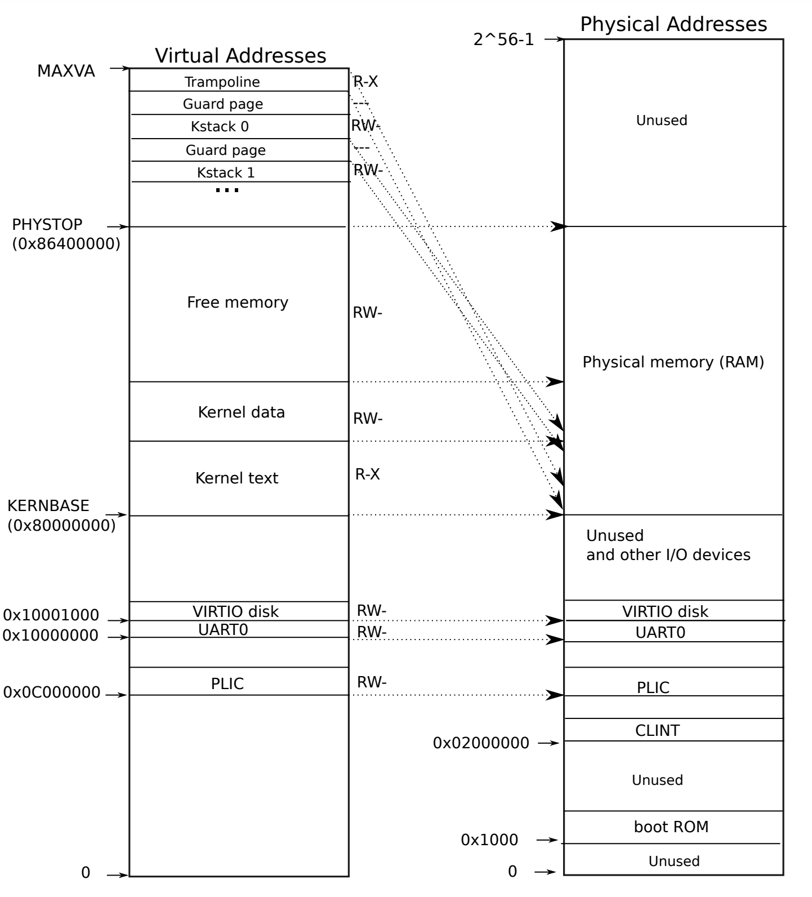

# 3. Special Topic: Traps

##### 03/06/2022 By Angold Wang

There are three kinds of event which cause the CPU to set aside ordinary execution of instructions and force a transfer of control to special code that handles the event:
1. **System Call:** When a user program executes the **`ecall`** instruction to ask the kernel to do something for it.
2. **Exception:** When an instruction (user/kernel) does something illegal, such as divide by zero or use an invalid virtual address.
* **Interrupt:** When a device signals that it needs attention.

**Trap is a generic term for these situations.**
Typically, whatever code was executing at the time of the trap will later need to resume, and shouldn't need to be aware that anything special happends.

**In this topic, we'll step into the actual `xv6` code and check the details of how traps were implemented by walking through a whole `SYS_write` system call procedule when we booting the `xv6`.**


## 0. Boot xv6

When the RISC-V computer powers on. It initializes itself and runs a boot loader which is stored in read-only memory. The boot loader loads the xv6 kernel into memory.

The loader loads the xv6 kernel into memory at physical address **`0x80000000`**. The reason it places the kernel at **`0x80000000`** rather than **`0x0`** is because the address range **`0x0:0x80000000`** contains I/O devices.



### i. `_entry`

Then in **machine mode**. The CPU executes xv6 starting at `_entry` **(kernel/entry.s)**

```asm
    # qemu -kernel loads the kernel at 0x80000000
    # and causes each CPU to jump there.
    # kernel.ld causes the following code to
    # be placed at 0x80000000.
.section .text
.global _entry
_entry:
	# set up a stack for C.
        # stack0 is declared in start.c,
        # with a 4096-byte stack per CPU.
        # sp = stack0 + (hartid * 4096)
        la sp, stack0
        li a0, 1024*4
        csrr a1, mhartid
        addi a1, a1, 1
        mul a0, a0, a1
        add sp, sp, a0
	# jump to start() in start.c
        call start
spin:
        j spin

```

**Basically, this piece of code does two things:**

1. **Set up a stack so that xv6 can run C code. and set the stack pointer `%sp` with the address `stack0 + 4096`.**
    * Set the stack in order to let xv6 run C code
    * The `stack0` is defined in `kernel/start.c`, which is the initial stack of xv6.
2. **Then calls into C code at `start` at `kernel/start.c`**


### ii. `start`

```c
// entry.S jumps here in machine mode on stack0.
void
start()
{
  // set M Previous Privilege mode to Supervisor, for mret.
  unsigned long x = r_mstatus();
  x &= ~MSTATUS_MPP_MASK;
  x |= MSTATUS_MPP_S;
  w_mstatus(x);

  // set M Exception Program Counter to main, for mret.
  // requires gcc -mcmodel=medany
  w_mepc((uint64)main);

  // disable paging for now.
  w_satp(0);

  // delegate all interrupts and exceptions to supervisor mode.
  w_medeleg(0xffff);
  w_mideleg(0xffff);
  w_sie(r_sie() | SIE_SEIE | SIE_STIE | SIE_SSIE);

  // configure Physical Memory Protection to give supervisor mode
  // access to all of physical memory.
  w_pmpaddr0(0x3fffffffffffffull);
  w_pmpcfg0(0xf);

  // ask for clock interrupts.
  timerinit();

  // keep each CPU's hartid in its tp register, for cpuid().
  int id = r_mhartid();
  w_tp(id);

  // switch to supervisor mode and jump to main().
  asm volatile("mret");
}
```

**Machine Mode vs. Supervisor Mode**: Machine mode has access to all the hardware features but does not have virtual-memory support.

1. **Writing `main`'s address into register `%mepc` in order to return to `main` after `start` finished**
2. **Writing `0` into the page-table register `satp` in order to disables virtual address translation** (we haven't set the page table yet).
3. Program the clock chip to generate clock interrupt (0.1s).

Although we haven't set any page table yet (even for kernel page table), we still can access some physical memory. The reason is that "**Identical Mapping**" in xv6, which  **mapping the resources at virtual address between `0x80000000` to `0x86400000` that are equal to the physical address.**


### iii. `main`

```c
// start() jumps here in supervisor mode on all CPUs.
void
main()
{
  if(cpuid() == 0){
    consoleinit();
    printfinit();
    printf("\n");
    printf("xv6 kernel is booting\n");
    printf("\n");
    kinit();         // physical page allocator
    kvminit();       // create kernel page table
    kvminithart();   // turn on paging
    procinit();      // process table
    trapinit();      // trap vectors
    trapinithart();  // install kernel trap vector
    plicinit();      // set up interrupt controller
    plicinithart();  // ask PLIC for device interrupts
    binit();         // buffer cache
    iinit();         // inode table
    fileinit();      // file table
    virtio_disk_init(); // emulated hard disk
    userinit();      // first user process
    __sync_synchronize();
    started = 1;
  } else {
    while(started == 0)
      ;
    __sync_synchronize();
    printf("hart %d starting\n", cpuid());
    kvminithart();    // turn on paging
    trapinithart();   // install kernel trap vector
    plicinithart();   // ask PLIC for device interrupts
  }

  scheduler();        
}

```


## 1. ecall


## 2. Trampoline


