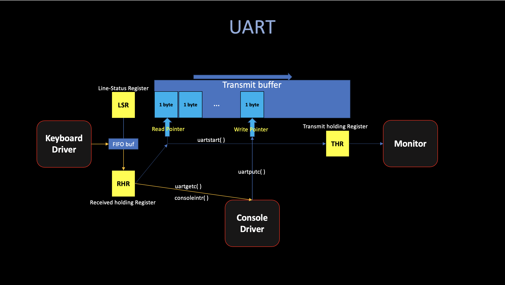
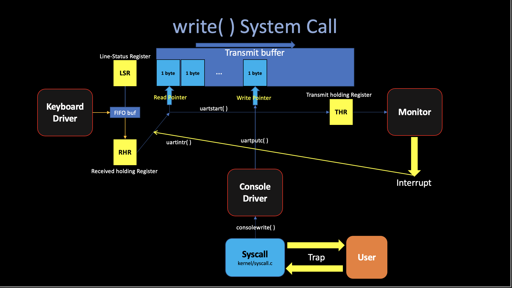
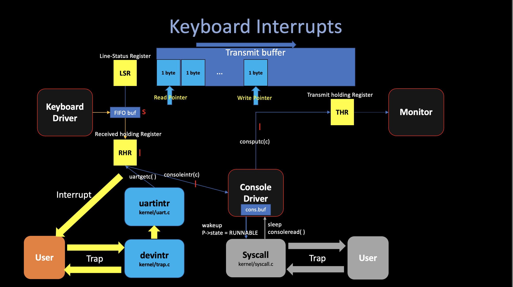
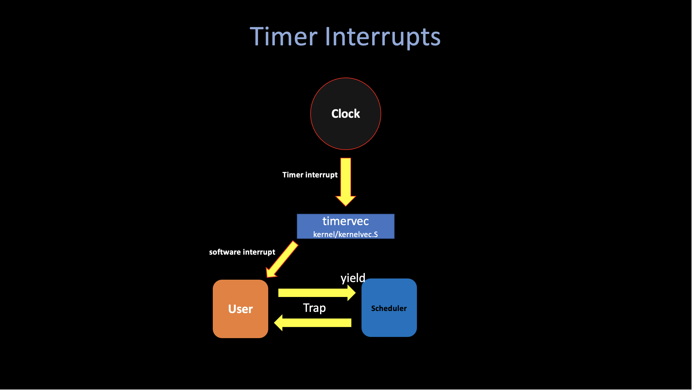

# 4. Interrupts

##### 04/03/2022 By Angold Wang

In the previous post, **[3. Traps](https://a4org.github.io/os/docs/lectures/3Traps.html)**, we went through the actual xv6 code to illustrate the actual mechanics in the system call.
I also mentioned at the begin of prev post, **The "traps" mechanisim is used in 3 different situations**:
1. **System Call**
2. **Device Interrupt**
3. **Fault and Exceptions**

Since the previous article covered the whole trap procedure (trampoline, recovery...) with actual xv6 code. Which is pretty much the same in these 3 situations. I'll treat the **"Trap"** as an abstract procedure and this lecture will focus on things other than traps.

## 0. Device Driver (UART)
**A driver is the code in an operating system that manages a particular device. Which:**
1. Configures the device hardware.
2. Handles the resulting interrupts.
3. Tells the device to perform operations.
4. **Interacts with processes that may be waiting for the I/O from the device.**

**While booting, xv6's `main` calls `consoleinit` to initialize the [UART](https://en.wikipedia.org/wiki/Universal_asynchronous_receiver-transmitter) hardware:**
* **Generating a recieve interrupt when the UART receives each byte of input. (In RHR)**
* **Generating a transmit complete interrupt each time the UART finishes sending a byte of output. (In THR)**



## 1. System Call
**A system call will pause the current user-process, cause a trap which saves user's current state... and jump to kernel space in order to execute the kernel syscall.**

Let's continue the actual **`write()`** system call we mentioned last article. The way that shell indicate that it is ready for user input is to print "$" in the console.

In the xv6 implementation, the shell calls `fprintf` function, which will eventually make a system call `write(2, "$", 1)`.

```c
  fprintf(2, "$");
```
Now we are in the kernel code, the `write` system call eventually arrives at **`consolewrite()`** located in `kernel/console.c`, which will write the stuff byte-by-byte by calling **`uartputc(c)`**.

Like I show in the figure, the UART device maintains an output buffer (`uart_tx_buf`) so that **writing processes do not have to wait for the UART to finish sending,** this mechanism, called **asynchrony**, separates device activity from process activity through **buffering** and **interrupts**. Instead, **`uartputc`** appends each character to the buffer, kick the UART hardware to start transmitting by calling **`uartstart()`**.

Basically, **`uartstart()`** writes the byte pointed to by the current write pointer into the `THE`, which is the transmit holding register. In our system, **once you write that byte into `THR`, the UART hardware will send the data to the Console (Monitor) to draw that byte on your monitor.**

Each time UART finishes sending a byte to console, it generates an interrupt. After the trap **`uartintr()`** calls **`uartstart()`** again, which hands the device the next buffered output character... It will keep that loop (the yellow arrow showing on the figure) until no data in the buffer (writep == readp).




## 2. Device Interrupts

There are basically two kinds of device interrupts -- The **Timer interrupts** and **others**.

### i. Device interrupts

For the device interrups, typically, when a user types **"ls"**, press enter in their keyboard and wants to pass this command to the shell. The UART hardware asks the RISC=V to raise an interrupt, The current user process will be interrupted and the xv6's trap handler will be activated. The trap handler calls **`devintr`** (`kernel/trap.c`), which looks at the RISC-V `scause` register to discover that the interrupt is from an external device. Then it asks a hardware unit called the `PLIC` to tell it which device interrupted. In this case, it was the UART, **`devintr`** calls **`uartintr`**.

**`uartintr`** reads any waiting input characters from the UART hardware and hands them to **`consoleintr`**, which **accumulate input characters in `cons.buf` until a whole line arrives.** The way is that **`consoleintr`** treats backspace and a few other characters specially. When a newline arrives, it wakes up a waiting **`consoleread`** (if there is one)(`p->status = RUNNABLE`), then back to the trap ret, and resume the interrupted process.

Once woken, **`consoleread`** will observe a full line in `cons.buf`, copy it to user space, and return from the trap to the user space.




### ii. Timer interrupts

Xv6 uses **timer interrupts** to switch among different **compute-bound process**.

The code **`timerinit`** in `kernel/start.c` initializing the clock hardware. Basically, it sets `mtvec` to **`timervec`** (kernel/kernelvec.S) in order to deal with each clock interrupts.

**A timer interrpt can occur at any point when user or kernel code is executing.** The basic strategy to handle a clock interrupt is to ask the RISC-V to **raise a "software interrupt"** and then immediately return (**then switch to the sheduler's context by calling `yield()`** which we will talk in great amount of details next post). The RISC-V delivers software interrupts to the kernel with the **ordinary trap mechanism**, and allows the kernel to disable them (very important for code executing in critical section).



## 3. Fault and Exceptions

