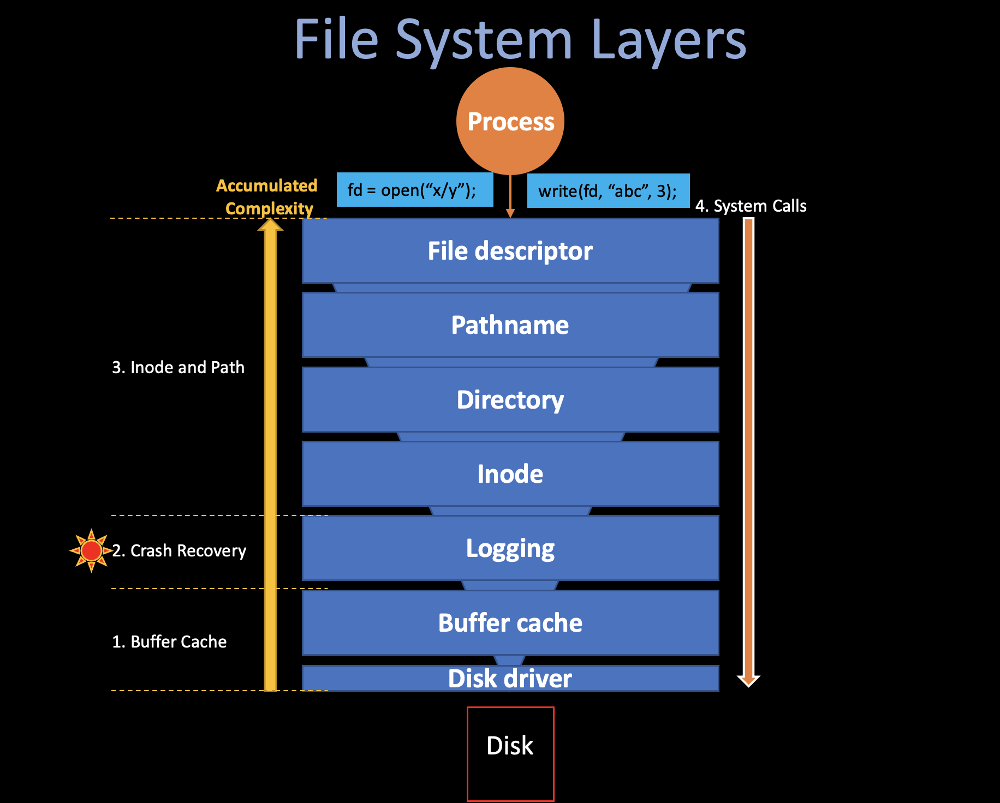

# 6. File System 

##### 05/20/2022 By Angold Wang

**File Systems** is one of the most special place in Operating System, it organize the stored data in hard disk, and maintain the **persistence** so that after a reboot, the data is still available.

The xv6 file system implementation is organized in **seven** layers, shown in the following figure. 



### Layer 1&2: Buffer Cache & Disk Driver
**Accessing a disk is orders of magnitude slower than accessing memory, so the file system must maintain an in-memory cache of popular blocks**, the buffer cache layer caches disk blocks and synchronizes access to them, making sure that only one kernel process at a time can modify the data stored in any particular block.

### Layer 3: Logging
The Logging layer helps the file system to support **Crash Recovery**, that is, **allow higher layers to wrap updates to several blocks in a transactions, and ensures that the blocks are updated atomically in the face of crashes** (i.e., all of them are updated or none).

If a crash (e.g., power failure) occurs, the file system must still work correctly after restart. The risk is that a crash might interrupt a sequence of updates and leave **inconsistent** on-disk data structures (e.g., a block that is both used in a file and marked free).

### Layer 4&5&6&7: Inode & Path
The file system needs on-disk data structures to represent the tree of named directories and files, to record the identities of the blocks that hold each file's content, and to record which areas of the disk are free.

In xv6, each file will be represented as an **Inode**, and the directory is a special kind of inde whose content is a sequence of directory entries. And the pathname layer provides hierachical path names like `/usr/angold/xv6/fs.c`, and resolves them with recursive look up. Finally, at the very top layer, the **file descriptor** abstracts many Unix resources (e.g., pipes, devices, files.) using the lower-layers interface we mentioned above, **simplifying the lives of application programmers.**


### Accumulated Complexity
There are two ways to understand the file system: **Bottom-up** and **Top-down**, we call the former "OS Designer's Perspective" and the latter "Application's Programmer's perspective". 

In the **Top-down** View, each API at the top layer (**`write`**, **`open`**, **`close`**) will be treated as serial instructions, that is: the **call stack** (`fn1()` -> `fn2()` ->... etc,.), which is relatively easy to figure out **how does the fs works** (by going through each routines), but it is very hard to understand **what is the design purpose of each layer** due to the accumlation of complexity at the high level. (it may also costs much time to walk through each
routines, especially in some big
systems)

In the **Bottom-up** View, when you start at the lowest level, the complexity is usually relatively small (code size, less routines...), and one more important thing is that **the higher level usually depends on the lower level underneath, which means after you understand these low-level stuff, the upper layer code seems highly structured.**  (lower layers ease the design of higher ones)

In this article, we will study the xv6 File System in both **Top-down** and **Bottom-up** view in order to have a fully understanding of File System, and answer questions like: **"how does file system works"** and **"why it looks like that (the design choice)"**. I believe the File System is a brilliant example to learn the "Accumulated Complexity" in System Engineering.


## 1. Buffer Cache

### i. Disk Driver

**Disk hardware traditionally presents the data on disk as a numbered sequence of *512-byte* blocks (sectors).**
> The **block** size that an operating system uses for its file system maybe different than the sector size that a disk uses, but typically the block size is a multiple of the sector size.

Each block on Disk has its own unique `blockno`, indicating the offset of specific data in disk. (sector 0 is the first 512 bytes, sector 1 is the next, and so on...)

The file system must have a plan for where it stores specific data (i.e., indes, data) on the disk, to do so, when xv6 boots, the `mkfs` (`kernel/mkfs.c`) will build the entile file system, you should see the following output from `mkfs` in the make output:

```
nmeta 70 (boot, super, log blocks 30 inode blocks 13, bitmap blocks 25) blocks 199930 total 200000
```

As you can see, xv6 divides the disk into several sections, as Figure 8.2 shows. The fils system does not use block 0 (it holds the boot sector). **Block 1 is called super block; it contains metadata about the file system:**
* The number of data blocks
* The number of inodes
* The number of blocks in the log
* ...


The code of disk driver of xv6 is in `kernel/virtio_disk.c`, typically, anytime the xv6 wants to read/write the data from disk, it will call `virtio_disk_rw(struct buf *b, int write)`, the data structure `buf` contains a specific buffer inside the buffer cache, where contains the target `blockno`.

### ii. Buffer Cache

The Buffer Cache has two jobs:
1. **Cache popular blocks so that they don't need to be re-read from the slow disk.**
2. **Synchronize access to disk block to ensure that only one copy of a block is in memory and that only one kernel thread at a time uses that copy.**

**The buffer cache has a fixed number of buffers to hold disk blocks**, which means that if the file system asks for a block that is not already in the cache, the buffer cache must recycle a buffer currently holding some other block. **The buffer cache recycles the least recently used (LRU) buffer for the new block.**


#### Buffer

```c
// kernel/buf.h
struct buf {
  int valid;   // has data been read from disk?
  int disk;    // does disk "own" buf?
  uint dev;
  uint blockno; // disk hardware can use blockno to find data
  struct sleeplock lock;
  uint refcnt;
  struct buf *prev;  // LRU cache list
  struct buf *next;
  uchar data[BSIZE]; // the stored 512 byte data
};
```

A buffer has two state fields associated with it:

* **`buf.refcnt` indicates that how many process currently own that buffer.** ( means doing some read/write on it )

* **`buf.valid` indicates that the buffer contains a copy of the block.**, the **`valid`** is set to 1 when someone read specific disk data into block by calling **`bread()`**, and will be set to 0 if its **`refcnt`** equal to 0 and being recycled.

#### Lock (Prevent Multiple Access)
As we said before, one of the main purpose of buffer cache is to prevent multiple kernel thread use that copy of disk block, and this mechanism is supported by the **Lock**.

**`bget`** (`kernel/bio.c`) **returns a free buffer in the buffer cache**, it scans the buffer list for a buffer with the given divice and sector numbers. If there is such buffer, **`bget`** acquires the **`sleep-lock`** for the buffer **to prevent multiple access (different kernel thread)** and then returns the locked buffer.
If there is no cached buffer for the given sector, bget must make one by reusing a buffer that held a different sector. (**LRU**).


**`bread`** (`kernel/bio.c`) calls **`bget`** to get a locked buffer from buffer cache for the given sector, and then call `virtio_disk_rw` to read the data from disk.

Once **`bread`** has read the disk and returned the locked buffer to its caller, the caller has exclusive use of the buffer and can read or write the data bytes. **If the caller does modify the buffer, it must call `bwrite` to write the changed data to disk before releasing the buffer.**

**Notice that there is at most one cached buffer per disk sector**, to ensure that readers see writes, and because the file system uses locks on buffers for synchronization. **`bget`  ensures this invariant by holding the `bcache.lock` continuously during the whole procedure of `bget`**.


#### LRU Buffer Cache

**The Buffer Cache is a doubly-linked list of buffers (more precisely, a circular linked list)**.  

```c
// kernel/bio.c
struct {
  struct spinlock lock;
  struct buf buf[NBUF]; // 13

  // Double Linked list of all buffers, through prev/next.
  // Sorted by how recently the buffer was used.
  // head.next is most recent, head.prev is least.
  struct buf head;
} bcache;
```


When the caller is done with a buffer, it must call **`brelse`**(`kernel/bio.c`) to release it, which will release the `sleep-lock` first in order to allow other kernel thread using that buffer, The **`brelse`** decreasing the `refcnt` of that buffer, if it reaches zero, **`brelse`** will **move the buffer to the front of the linked list.**

**Moving the buffer causes the list to be ordered by how recently the buffers were used**: The first buffer in the list is the most recently used and the last is the least recently used.

The two loops in **`bget`** take advantage of this:
* **In the first loop, we want to check whether there is a valid cached block. If we check the most recently used buffers first** (starting at `bcache.head` and following `next` pointers) **will reduce the scan time, where there is a good locality of reference.**

* If the first failed, **In the second loop, we want to pick a reusable block (`refcnt==0`). If we check the least recently used buffers first** (starting at `bcache.head` and following `prev` pointers) **will also reduce the scan time.**

```c
  // See whether it is cached.
  for(b = bcache.head.next; b != &bcache.head; b = b->next){
    if(b->dev == dev && b->blockno == blockno){
      b->refcnt++;
      release(&bcache.lock);
      acquiresleep(&b->lock);
      return b;
    }
  }

  // Not cached.
  for(b = bcache.head.prev; b != &bcache.head; b = b->prev){
    if(b->refcnt == 0) { 
      b->dev = dev;
      b->blockno = blockno;
      b->valid = 0;
      b->refcnt = 1;
      release(&bcache.lock);
      acquiresleep(&b->lock);
      return b;
    }
  }

```

## 2. Crash Recovery

### i. Problem: Inconsistent State on Disk
Imagine you are running `$make` interacting with the file system, and somewhere doing that thing, a power failure happends(run out of battery). After that, you plugin and reboot your machine, when you run `$ls`, you hope your file system is in the good state. **A tricky case is that many file system operations have multi-step operations, if we crash just in the wrong place in these multi-step operations, the file system actually may end up being on this inconsistent for that short
period of time, and if the power failure just happend there, something bad could happends.**


### ii. Solution: Logging

Xv6 solves the problem of crashes during file-system operations with a simple form of **logging**, which is originally coming out of the database world, and a lot of file systems using logging these days, one of the reason it is popular because it ia a very principled solution.

**An xv6 system call does not directly write the on-disk file system data structures. Instead, it places a description of all the disk writes it wishes to make in a log on the disk, once the system call has logged all of its writes, it writes a special commit record to the disk indicating that the log contains a complete operation.** At that point the system the system call copies the writes to the on-disk file system data structures and finally erase the log on disk.

### iii. Log Design
```c
// kernel/log.c
struct logheader {
  int n;
  int block[LOGSIZE];
};

struct log {
  struct spinlock lock;
  int start;
  int size;
  int outstanding; // how many FS sys calls are executing.
  int committing;  // in commit(), please wait.
  int dev;
  struct logheader lh;
};
```

The two main data structures of log is **`logheader`** and **`log`**, all of them are in `kernel/log.c`.
* **`log.start` indicate the start `blockno` inside disk,** which will be used when writing log to the disk.
* **`log.outstanding` counts the number of system calls that have reserved log space.**
    * Incrementing `log.outstanding` both reserves space and prevents a commit from occuring during this system call.
    * Decrementing `log.outstanding` when a file system call finish its write/read operations and ready to be commit.
* **`log.lh.n` indicate the current log size of file system.** If it is greater than zero, we know that there are some blocks in the log that need to be installed to the disk.
* **`log.lh.block[i]` stores the `blockno` of the `start+i` log in the disk,** which we will discuss later.


The log resides at a known fixed location, specified in the superblock. **It consists of a header block followed by a sequence of updated block copies** ("logged blocks"). The header block contains an array of sector numbers (`log.lh.block`), one for each of the logged blocks, and the count of log blocks (`log.lh.n`). The count in the header block on disk is either zero, indicating that there is no transaction in the log, or non-zero, indicating that the log contains a complete committed transaction with the indicated number of logged blocks.

Here is a High-level picture of logging in xv6.


### iv. Log Implementation

All logging code are in **`kernel/log.c`**, the following figure shows the detailed structure and data flow of logging in xv6.


## 3. Inode and Path

## 4. System Calls
