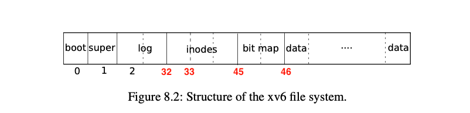

# File System (ii)
##### 05/25/2022 By Angold Wang


## 3. Inode and Path
**Up until log, these lower layers are all interacting with disk blocks (sectors) with a specific `blockno`.** But in the file systems that we are using in our daily life, seems that we are manipulating data on specific **files**, and finding them using **path names**.

The upper layers (layer 4, 5, 6, 7) is trying to ease the user by providing **path, file, directory, etc,** which we are familar with.

### i. Block Allocator
File and directory is stored in **disk blocks**, which must be allocated from a free pool. Xv6's block allocator maintains a **bitmap** on disk, **with one bit per block.** A zero bit indicates that the corresponding block is free; a one bit indicates that it is in use.

The main API function that the block allocator provided is **`balloc()`** which allocates a new disk block and return its **`blockno`**. The loop inside `balloc` is split into two pieces:
* The outer loop reads each block of bitmap bits (on disk).
* **The inner loop checks all Bits-Per-Block(BPB) bits in a single bitmap block.**

The loop looks for a block whose bitmap bit is zero, indicating that it is free. If **`balloc`** finds such a block, it updates the block and writes it to the disk (`log_write`) then return the `blockno` of that block.


```c
// kernel/fs.c:
  for(b = 0; b < sb.size; b += BPB){
    // for each bitmap block
    bp = bread(dev, BBLOCK(b, sb));
    for(bi = 0; bi < BPB && b + bi < sb.size; bi++){
      m = 1 << (bi % 8);
      if((bp->data[bi/8] & m) == 0){  // Is block free?
        bp->data[bi/8] |= m;  // Mark block in use.
        log_write(bp); // write to the log buffer (bitmap -> disk)
        brelse(bp);
        bzero(dev, b + bi);
        return b + bi;
      }
    }
  }
```

### ii. Inode
You should view File System as **many on-disk data structures.** (tree, dirs, inodes, blocks) with two allocation pools: (**blocks** and **inodes**)

Up to now, **we walk through one of the two allocations pools in Xv6 - the blocks** and understand how the file system manipulate this on-disk data structures. The next part would be another allocation pool: **inodes.**

First let's do not talk about the code or even design, let's look at xv6 in action with some real system calls and **illustrade on-disk data structure via how updated.**

Here is the sequence of disk writes involved in each operation of these two write system calls in echo (`user/echo.c`).
We can track these syscalls by adding a `printf` statement in `log_write`, which will be called when a atomic series of disk writes happends. (e.g,. a write system call).

```
$ echo "hi" > x

--- create the file
log write block: 33  // by ialloc: allocate inode in inode block 33
log write block: 33  // by iupdate: update inode (e.g., set nlink)
log write block: 70  // by writei: write to the data block of this directory entry (dirlink)
log write block: 32  // by iupdate: update the directory inode since we change the size of it.
log write block: 33  // by iupdate: itrunc new inode (even through nothing changed)

--- write "hi" to file x
log write block: 45  // by balloc: allocate a block in bitmap block 45
log write block: 628 // by bzero: zero the allocated block
log write block: 628 // by writei: write to it (hi)
log write block: 33  // by iupdate: update inode

--- write "\n" to file x
log write block: 628 // by writei: write to it (\n)
log write block: 33  // by iupdate: update inode

```



#### 1. Inode Design

The term *inode* stands for two things in Xv6:
* **On-disk datastructure** containing a file's size and list of data block numbers
* **In-memory copy of this disk inode in the inode table** contains extra informantion needed within the kernel.

The on-disk inodes are packed into a contiguous area of disk called the **inode blocks**. Just like block, every inode is in the same size

##### Disk Inode `dinode`
```c
// kernel/fs.h
// On-disk inode structure
struct dinode {
  short type;           // File type
  short major;          // Major device number (T_DEVICE only)
  short minor;          // Minor device number (T_DEVICE only)
  short nlink;          // Number of links to inode in file system
  uint size;            // Size of file (bytes)
  uint addrs[NDIRECT+1];   // Data block addresses (blockno)
};

```

##### In-memory Inode `inode`
```c
// kernel/file.h
// in-memory copy of an inode
struct inode {
  uint dev;           // Device number
  uint inum;          // Inode number
  int ref;            // Reference count
  struct sleeplock lock; // protects everything below here
  int valid;          // inode has been read from disk?

  // copy of disk inode
  short type;
  short major;
  short minor;
  short nlink;
  uint size;
  uint addrs[NDIRECT+1];
};
```

##### Inode Table `itable`
```c
// kernel/fs.c
struct {
  struct spinlock lock;
  struct inode inode[NINODE];
} itable;
```


### iii. Directory

### iv. Path Name

### v. File Descriptor


## 4. System Calls
